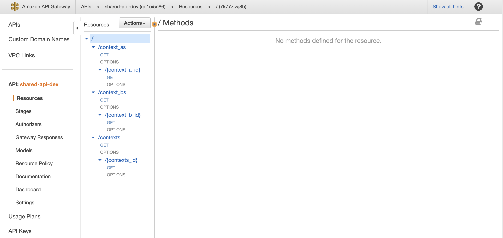

# SHARED-API

This project is an example of share an API endpoint between services.

- AWS API Gateway
- Serverless Framework
- Serverless Compose

<p align="center">
  
</p>

References:

[aws-guide-serverless](https://www.serverless.com/framework/docs/providers/aws/guide/serverless.yml/)

[serverless-compose](https://www.serverless.com/framework/docs/guides/compose)

```
npm i -g serverless@3.22.0
npm i serverless-plugin-split-stacks@1.11.3
```

### deploy
```
> shared-api
serverless deploy
```